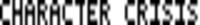

<p align="center">
	
</p>

<h1 align="center">Character Crisis</h1>

<p align="center">
	<strong>Generate ASCII art & text images!</strong>
</p>

## 🚀 Overview

Welcome to **Character Crisis**! This program allows you to create ASCII art for an input text string, using a given charmap. The program also stores the text as an image.

> [!NOTE]
> The logo for the program was created using the program itself.

## 🎨 Features

- **Dynamic loading of charmaps**: The program can load any charmap from a file, allowing for custom charmaps, of different row sizes.
- **Efficient storing of charmaps**: The program has 4 columns per row, so that each character can be represented by 1 hex digit for it's ASCII art charmap character.
- **Storing text images**: The program displays the ASCII art in the terminal, but also stores a BMP image of the text in the ASCII art font.

## ✅ TODO

- [ ] Use different base number system like base64 instead of hex (base 16) to store more columns per row because 4 is asymmetric and not very efficient.
	- 5 columns per row would look nice and symmetric. 5x5 is also square (the 4x4 does not look good because it has so few grid cells).
- [ ] Add functionality for escape characters such as `\t` and `\n`.
- [ ] Add more characters to the charmaps (rather than A-Z, make it !-~).
- [ ] Add charmaps and functionality for segment displays (7 segment, 14 segment, etc.).

## 🛠️ Installation

To get started with the program, follow the steps below:

1. **Clone the repository**
```sh
git clone https://github.com/321BadgerCode/character_crisis.git
cd ./character_crisis/
```

## 📈 Usage

To use the program, follow the instructions below:

1. **Run the program**
```sh
# python ./load_charmap.py ./charmap4x4.txt 4 | python ./main.py "hello world"
python ./load_charmap.py ./charmap4x5.txt | python ./main.py "hello world"
```

## 📚 Storing Charmaps

**Example**:  
> `A` from [charmap4x5.txt](./charmap4x5.txt)
```
A
0110
1001
1111
1001
1001
```

The 1's represent an occupied grid cell in the ASCII art, and the 0's represent an empty grid cell. So, the ASCII art representation of `A` is:
```
 ## 
#  #
####
#  #
#  #
```

**How it works**:  
- The first line is the character to be represented.
- The next 5 lines are the rows in the 4x5 ASCII art representation of the character (the rows have to be 4 characters long because they're stored as hex digits).
	- Each grid cell in the ASCII art is represented by a 0 or 1.

**Example explanation**:  
Each row is a binary number, where each bit represents a grid cell in the ASCII art. The row is then converted to a hex digit, which is stored in the charmap.
```
A
0110 -> 2^1 + 2^2 = 6 => 0x6
1001 -> 2^0 + 2^3 = 9 => 0x9
1111 -> 2^0 + 2^1 + 2^2 + 2^3 = 15 => 0xf
1001 -> 2^0 + 2^3 = 9 => 0x9
1001 -> 2^0 + 2^3 = 9 => 0x9
```
Going in chronological order from the first row to the last, the hex digits are 0x6, 0x9, 0xf, 0x9, 0x9. Therefore, the ASCII art representation of `A` is `0x69f99`.

## 📜 License

[LICENSE](./LICENSE)